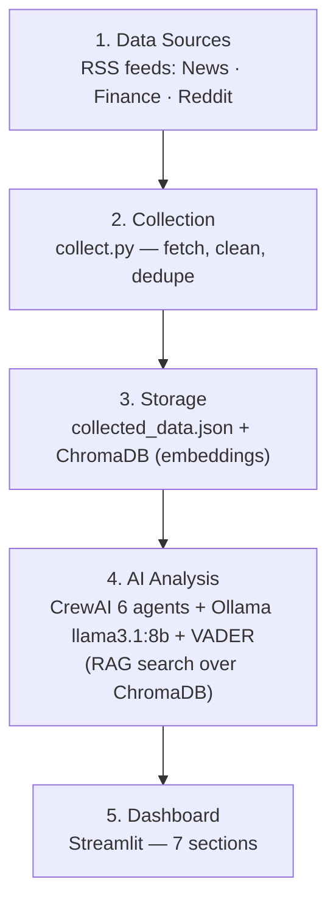
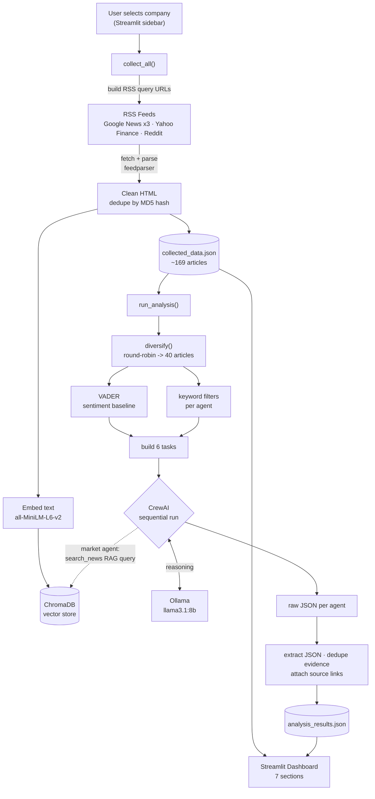
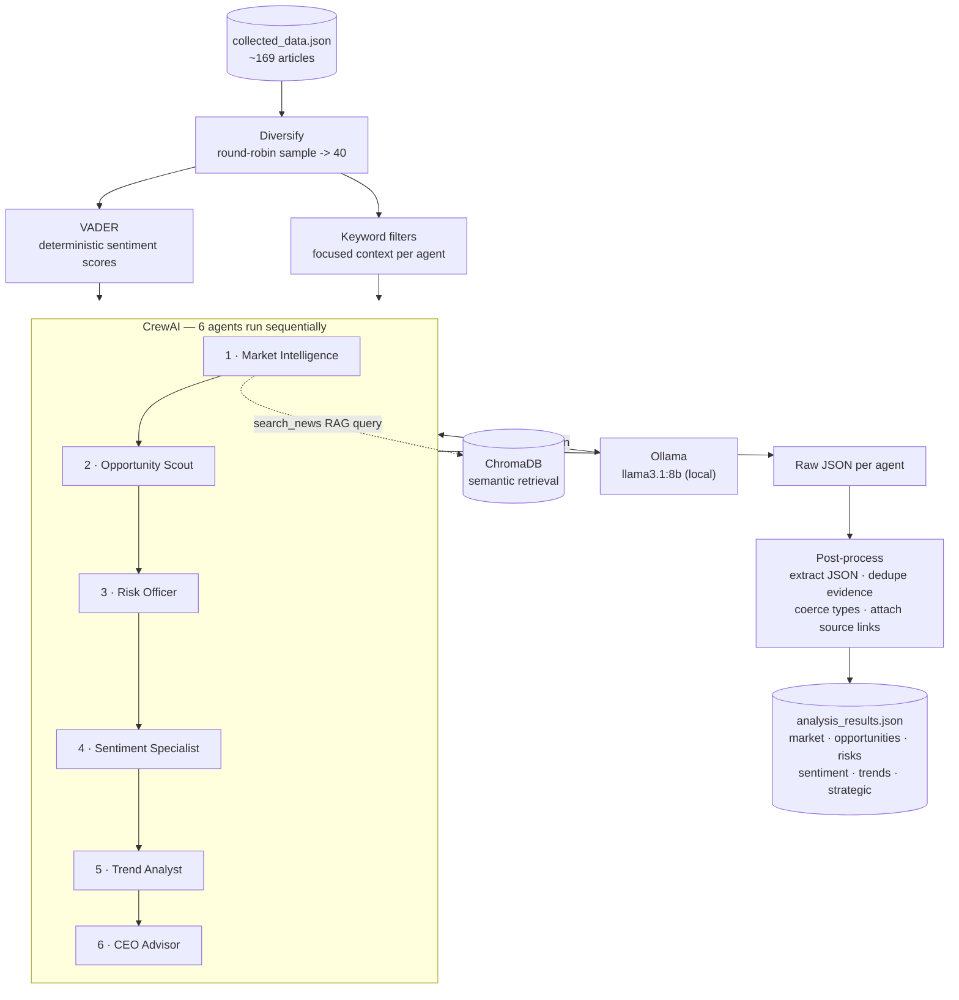

# AI CEO — Strategic Intelligence Agent

An AI-powered strategic intelligence system that collects live news about a chosen
company, reasons over it with a team of local LLM agents, and presents executive-level
opportunities, risks, trends, and recommendations in an interactive dashboard.

It is built to answer one question: **"If you were the CEO today, what would you do next, and why?"**

The system uses only open-source / locally-hosted models — **no commercial LLM APIs**.

---

## What it does

- Collects live information from multiple public RSS sources (news, finance, community)
- Stores articles as a JSON corpus **and** as embeddings in a vector database
- Runs six specialised AI agents to analyse the company's environment
- Identifies opportunities, risks, and emerging trends
- Generates evidence-backed strategic recommendations and a CEO briefing
- Presents everything in a seven-section Streamlit dashboard

---

## System Architecture



---

## Data Flow



---

## AI Pipeline



Each agent is given a role, goal, and backstory, plus only the context relevant to its
task. The market agent additionally has a `search_news` tool that performs **semantic
retrieval (RAG)** over the full ChromaDB corpus when it needs more detail than the
pre-supplied context. All agents reason on a local Ollama model; their JSON outputs are
cleaned and source-linked before being saved for the dashboard.

---

## Technology Stack

| Layer              | Technology                              | Purpose                                      |
|--------------------|-----------------------------------------|----------------------------------------------|
| Language           | Python 3.12                             | Core implementation                          |
| LLM (reasoning)    | Ollama — llama3.1:8b                    | Local, free, open-source reasoning engine    |
| Agent framework    | CrewAI                                  | Orchestrates the six specialised agents      |
| Vector store       | ChromaDB                                | Knowledge repository for semantic retrieval  |
| Embeddings         | sentence-transformers / all-MiniLM-L6-v2| Converts articles to vectors                 |
| Retrieval          | RAG (semantic search)                   | Agent queries the corpus by meaning          |
| Sentiment          | vaderSentiment                          | Deterministic sentiment scoring              |
| Data collection    | feedparser + requests                   | Fetches and parses RSS feeds                 |
| Dashboard          | Streamlit                               | Executive intelligence UI                    |
| Storage            | JSON files + persistent ChromaDB        | Dashboard data + vector index                |

---

## Project Structure

```
.
├── app.py            # Streamlit dashboard (7 sections)
├── crew.py           # CrewAI agents, tasks, RAG tool, analysis pipeline
├── collect.py        # RSS collection, cleaning, dedup, indexing
├── knowledge.py      # ChromaDB vector store + embeddings (RAG layer)
├── config.py         # Company presets, RSS source builder, model config
├── requirements.txt  # Dependencies
├── collected_data.json    # (generated) collected articles
├── analysis_results.json  # (generated) agent analysis output
└── chroma_store/          # (generated) persistent vector database
```

---

## Design Decisions

**Multi-agent instead of one prompt.** Six focused agents — one per dashboard section —
give sharper, more separable output than a single prompt doing everything, and map
cleanly onto the deliverable's sections.

**Local LLM via Ollama.** The rubric forbids commercial APIs. A local llama3.1:8b model
is free, private, fully offline, and reproducible.

**Hybrid sentiment: VADER + LLM.** VADER produces fast, deterministic, reproducible
numeric scores; the LLM only *interprets* them. Small models are not trusted to count or
score reliably.

**Two storage paths.** Articles are written to JSON (for the dashboard) and embedded into
ChromaDB (for retrieval). Two stores, two purposes.

**RAG semantic search, scoped to one agent.** The market agent can query the full corpus
by meaning when it needs more detail. It is scoped to a single agent because tool-calling
reliability drops on 8B models — validated on one before any wider rollout. A keyword
fallback runs if the vector store is unavailable.

**40-article context cap.** More articles mean longer prompts; past ~40 the heaviest agent
(CEO) overflows the context window and returns truncated JSON. The limit was found
empirically — 80 broke the CEO briefing, 40 is stable.

**Source diversification.** A round-robin across feeds prevents one source from dominating
the agents' context.

**Evidence linked to sources.** The model writes evidence in its own words and does not
return citations, so each evidence sentence is matched back (by word overlap) to its most
likely source article and shown as a clickable headline. Weak matches are left unlinked
rather than fabricated.

**Defensive post-processing.** Local models produce messy output, so the pipeline strips
code fences, extracts JSON via regex fallback, deduplicates evidence, coerces types, and
normalises the shape of the CEO output. This is what turns an unreliable model into a
stable pipeline.

---

## Setup

**1. Install Ollama and pull the model**

```bash
ollama pull llama3.1:8b
ollama serve
```

**2. Create a virtual environment and install dependencies**

```bash
python -m venv venv
# Windows:
venv\Scripts\activate
# macOS / Linux:
source venv/bin/activate

pip install -r requirements.txt
```

The first run downloads the embedding model (`all-MiniLM-L6-v2`, ~90 MB) once and caches it.

---

## How to Run

**Optional warm-up** (recommended before a live demo — gets the model download out of the way):

```bash
python collect.py
```

Look for `Chroma: indexed N articles for <company>`, which confirms the vector store works.

**Launch the dashboard:**

```bash
streamlit run app.py
```

Select a company in the sidebar and click **Run Analysis**. Collection takes a few seconds;
the six agents then run sequentially (one to two minutes on an 8B model).

---

## Dashboard Sections

1. **Company Overview** — name, industry, document count, sources, last update
2. **Market Intelligence** — recent news, competitor activity, emerging tech, announcements
3. **Opportunity Monitor** — opportunities with impact, evidence, confidence
4. **Risk Monitor** — risks with category, severity, evidence, confidence
5. **Sentiment Analysis** — overall sentiment, distribution, real date-based trend, drivers
6. **Strategic Recommendations** — emerging trends and prioritised, evidence-backed recommendations
7. **CEO Briefing** — what happened, why it matters, what to do next

---

## Requirements Mapping

| Requirement                          | How it is met                                              |
|--------------------------------------|------------------------------------------------------------|
| 3+ sources, 100+ documents, automatic| 5 RSS feeds, ~169 articles per run, one-click collection   |
| Knowledge repository                 | ChromaDB persistent vector store                           |
| Information processing               | HTML cleaning, MD5 dedup, embeddings, indexing             |
| Strategic intelligence engine        | Opportunity / Risk / Trend agents                          |
| AI CEO agent                         | CEO Advisor agent — recommendations + briefing             |
| Evidence-based recommendations       | Evidence linked to source articles, impact, risk level     |
| Open-source LLM only                 | llama3.1:8b via Ollama (no commercial API)                 |
| Retrieval mechanism                  | RAG semantic search over ChromaDB                          |

---

## Limitations

- RSS-only collection; depends on feed availability (Reddit often rate-limits to zero).
- Sentiment "trend" is a coarse newest-vs-oldest comparison, not a true time series.
- An 8B model occasionally drifts from the requested JSON schema; the post-processing layer
  catches most of this, but it is the source of any empty section.
- Evidence linking is lexical (word overlap), so abstract evidence sentences may not match
  a source and fall back to "collected news".
