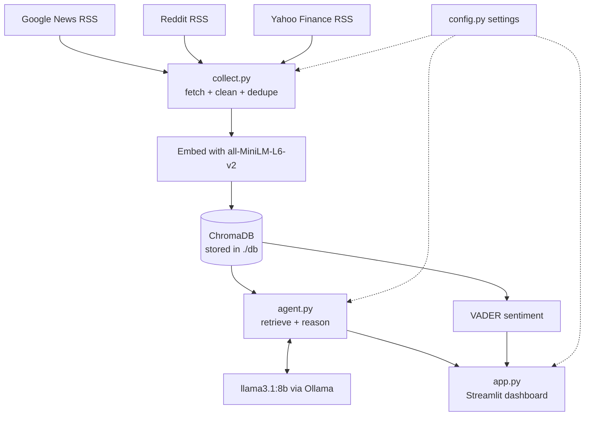
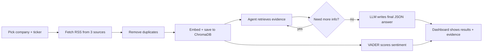

# AI CEO – Strategic Intelligence Agent

This is my project for the NLP module. The idea was to build something that acts
like a strategy advisor to a company's CEO: it pulls in live information about a
company from the web, stores it, reasons over it with a local language model, and
then gives back proper strategic insights (opportunities, risks, trends,
recommendations) instead of just listing the news.

The whole point was *not* to summarise articles. It's supposed to actually reason
about what the information means for the business and back up every claim with the
evidence it used. So the final question it tries to answer is basically "if I were
the CEO right now, what should I do and why?"

Everything runs locally. No OpenAI / paid APIs are used anywhere — the reasoning is
done by Llama 3.1 8B through Ollama on my own machine, which is what the brief asked for.

## How to run it

You need Python and Ollama installed first, and you need to pull the model:

```
ollama pull llama3.1:8b
```

Then install the libraries:

```
pip install streamlit pandas chromadb sentence-transformers feedparser vaderSentiment ollama
```

And run:

```
streamlit run app.py
```

Pick a company from the sidebar, hit "Collect & Analyze" and wait a bit. The first
run is slower because it has to download the embedding model and go fetch all the
live data.

If you just want to test the data collection on its own without the UI:

```
python collect.py
```

## The files

I kept it to four files so it stays easy to follow:

- **config.py** – all the settings in one place (which model, which embedding model,
  the list of companies and their tickers/industries).
- **collect.py** – goes out and grabs the data, cleans it, and puts it in the database.
- **agent.py** – the actual brain. Does the retrieval, the reasoning loop, and sentiment.
- **app.py** – the Streamlit dashboard that shows everything.

## Architecture

There are basically four parts: collecting the data, storing it, reasoning over it,
and showing it. Each part is its own file so I can change one without breaking the others.



## Data flow

This is what happens step by step when you click the button:



In words:

1. You choose a company. For the preset ones the ticker and industry are already
   filled in.
2. `collect.py` searches Google News a few different ways (just the company name,
   plus "AI", "competitors", "earnings"), grabs Reddit posts, and if there's a
   ticker it grabs Yahoo Finance headlines too.
3. Duplicates get removed (same link or same title).
4. Each item gets turned into a vector with all-MiniLM-L6-v2 and saved into ChromaDB.
   I use a hash of the URL as the ID so re-running just updates instead of making copies.
5. The agent then retrieves the most relevant docs and asks the model whether it has
   enough to cover opportunities/risks/competitors/trends. If not, it picks a new
   search and goes again (up to 3 times).
6. Once it's happy, one final model call writes out the whole answer as JSON, citing
   which evidence it used for each point.
7. The dashboard displays everything, and there's a table at the bottom that maps
   every [number] citation back to the actual article.

## Tech stack

- **Python** for everything
- **Ollama + Llama 3.1 8B** as the reasoning model (local, free, open source)
- **all-MiniLM-L6-v2** (sentence-transformers) for the embeddings
- **ChromaDB** as the vector database / knowledge store, with RAG-style retrieval
- **feedparser** to read the RSS feeds
- **vaderSentiment** for sentiment scoring
- **Streamlit** for the dashboard
- **pandas** for the tables and charts

Data comes from Google News, Reddit and Yahoo Finance, which gives me the three
independent sources the brief wanted.

## AI pipeline

There are three AI bits really.

**Embeddings + retrieval (RAG).** Every document gets embedded once when it's saved.
When the agent searches, the query gets embedded with the *same* model and ChromaDB
returns the closest matches. The embedding model name lives in config.py so the
indexing side and the query side can never accidentally use different models (if they
did, retrieval would quietly stop working, which was a trap I wanted to avoid).

**The reasoning loop.** Instead of just asking the model once, the agent does a
search-then-decide loop. It searches, looks at what it got, and the model decides if
there's a gap (like competitors or regulation) that needs another search. This way it
actively goes and fills in missing angles instead of just using whatever came back first.

**Final answer.** The last model call is told to only use the numbered evidence it was
given and to cite it by number. It returns a fixed JSON shape with opportunities,
risks, trends, recommendations and the CEO briefing. Because everything is tied to
evidence numbers, you can always check where a recommendation came from.

## Design decisions

A few choices I made and why:

- **Local model instead of an API.** The brief doesn't allow paid APIs, and running
  it locally keeps the data on my machine. I made the model a single setting so I can
  switch to a smaller/faster one (like qwen2.5:3b) if my laptop struggles.

- **One ChromaDB collection per company.** Each company gets its own collection
  (named from a slug of the company name). That way switching between companies never
  mixes their evidence together.

- **Hash of the URL as the document ID.** Re-collecting then updates existing items
  instead of piling up duplicates, so the database stays clean.

- **A reasoning loop instead of a single prompt.** One prompt over the first batch of
  results felt too shallow. The loop gives broader coverage, which fits the "reason
  about the business" requirement better than just summarising.

- **Forcing evidence citations.** Making the model cite evidence by index, and showing
  a table that resolves those numbers, means every recommendation can be traced back
  and isn't just the model making things up.

- **Caching in Streamlit.** Collecting data and running the model are slow, so I cache
  them and added a "Re-collect" button to clear the cache when I want fresh data.

One thing I'd improve if I had more time: the news feed sometimes pulls in unrelated
stuff that just happens to mention the company (accident reports, random hobby
articles), which isn't very useful for a CEO. A relevance filter on the collected docs
would clean that up.
